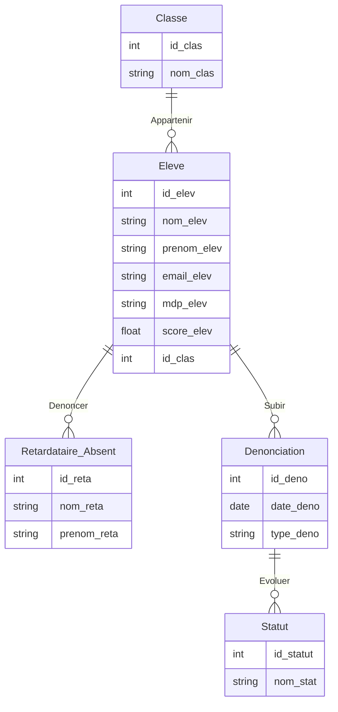

# Getting Started with Snitch & Go

## Available Scripts

Pour lancer le projet il faut effectuer :\

### `npm start`

Lance l'application en mode développement.\
Ouvrez [http://localhost:3000](http://localhost:3000) pour lancer la page web.

### `cd src/server/ -> node server.js`

Lancez le server pour faire fonctionner l'application.\

# Présentation

## Le projet

Snitch & Go est une web-app à destination des étudiants afin de dénoncer le retard ou l’absence d’un de ses camarades pendant un cours. Chaque personne de la classe peut observer les dénonciations et ajouter un vote ou non augmentant le score de la personne ayant remplie son accusation et baissant celui de l’accusé en fonction de l’algorithme des votes (cf schéma ci-dessous).  

## Composition

Le projet ce compose de 2 pages pour l’instant:

- La page “*Home*” avec le “*Dashboard*” (composé du ranking des pires élèves, et des dernières accusations disponible) et avec un bouton “*Report*” ouvrant un formulaire pour dénoncer un camarade.
- La page Classe avec la liste des élèves de sa classe, que l’on peut dénoncer grâce à un bouton “*Report*”

Les autres éléments composant le projet sont : 

- Une base de données pour stocker les informations des élèves et les accusations (Axios et json déployer pour l’instant, mais une Firebase qui le sera par la suite)
- Un algorithme de calcul des scores basé sur les votes (pas encore en production)
- Un onglet pour accéder aux informations du profil et voir son score
- Un server local avec une API

## Les technologies

Pour ce projet nous avons décider d’utiliser le framework* **React.js** pour sa simplicité de mise en place et d’utilisation. Nous avons également utiliser le framework front-end* **Bootstrap** qui permet de mettre en forme les pages web de manière rapide et efficace.

La base de données de ***Snitch & Go*** est sur **FireBase**, un hébergeur de BDD MySQL. Pour notre démo un simple server **Node.js** nous permet de lire et écrire des données dans un fichier JSON.

Le projet est quand à lui héberger sur GitHub, une tiers application qui permet la gestion de version grâce à l’outil Git.

Enfin le site web est hébergé sur **Vercel**, un hébergeur web gratuit.

# Fonctionnement

## Architecture

L’architecture choisis pour notre projet est une architecture classique du framework React. 

Un dossier “*api*” s’occupe de la connection au server. Les dossiers “*Data*” et “*server*” servent à gérer nos données en interne. Les dossiers “*pages*” et “*components*” nous servent quand à eux, à mettre en forme l’application.

```
.
├── public
│   └── Img
└── src
    ├── Data
    │   └── Data.json
    ├── Styles
    ├── api
    │   ├── reports.js
    │   └── personnes.js
    ├── components
    ├── pages
    │   ├── Home.js
    │   ├── Classe.js
    │   └── Profile.js
    └── server
        └── server.js
```

## API

Notre API utilise un fonctionnement basique grâce à **Axios**, une bibliothèque JavaScript de requête HTTP*. 

Chaque requête est envoyé à notre serveur, qui lui renvoie les informations souhaitées à l’API, à partir de notre fichier JSON. 

```jsx
// ./src/api/reports.js :

import axios from 'axios';

// URL to call the server
const BASE_URL = 'http://localhost:5001/personnes';

// Function to get all personnes
export const getPersonnes = async () => {
    const response = await axios.get(BASE_URL);
    return response.data;
};
...
_________________________________________________________
// ./src/server/server.js

app.use(cors()); // Enable CORS
app.use(bodyParser.json()); // Parse JSON bodies

// Load JSON data
let data = require('../Data/Data.json');

// Use the data loaded to get all reports that can be display
app.get('/reports', (req, res) => {
    res.json(data.reports.filter(report => report.display === 'y'));
});
...
```

## Base de données

Notre base de données se compose de deux éléments comme indiqué au-dessus. Une BDD Firebase, et un fichier JSON sensé reproduire cette même base de données de manière simplifié.

La base de données Firebase se compose de 5 tables :

- Classe (La table représentant une promotion d’élèves)
- Élève (La table représentant un élève, son score, etc)
- Dénonciation (La table représentant la dénonciation d’un élève par un autre)
- Retardataire_Absent (La table représentant l’élève accusé)
- Statut (La table représentant le statut d’une dénonciation, soit Vrai, soit Faux)



Le fichier JSON lui, se compose de deux éléments :

- personnes (représentant un élève)
- reports (représentant une accusation)

```jsx
{
	"personnes" : [
		{
			"id": 0,
      "nom": "Dupont",
      "prenom": "Jean",
      "score": 120, // score de l'élève
      "pp": "../img/shrok.jpg" // image de l'élève
		}, 
		{...}
	],
	"reports" : [
		{
			"id": 0,
      "name": "John",
      "firstname": "Doe",
      "date": "2024-09-24 11:10:45", // La date et l'heure de la dénonciation
      "typeReport": "R", // Le type de dénonciation 
      "nbVote": 16, // Le nombre de votes
      "cours": "Python",
      "display": "n", // Si la dénonciation s'affiche encore pour l'utilisateur
      "personId": 0 // L'id de l'élève qui signale
		},
		{...}
	]
}
```
